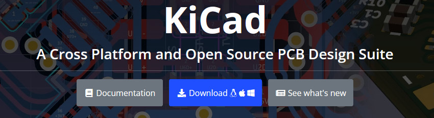
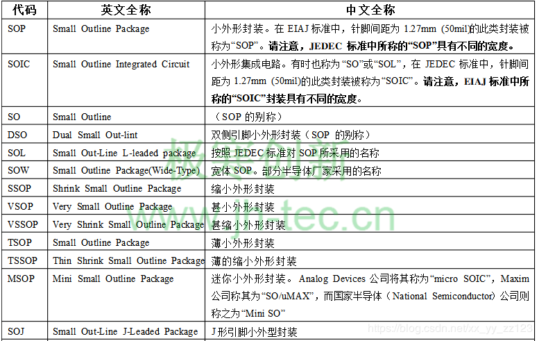
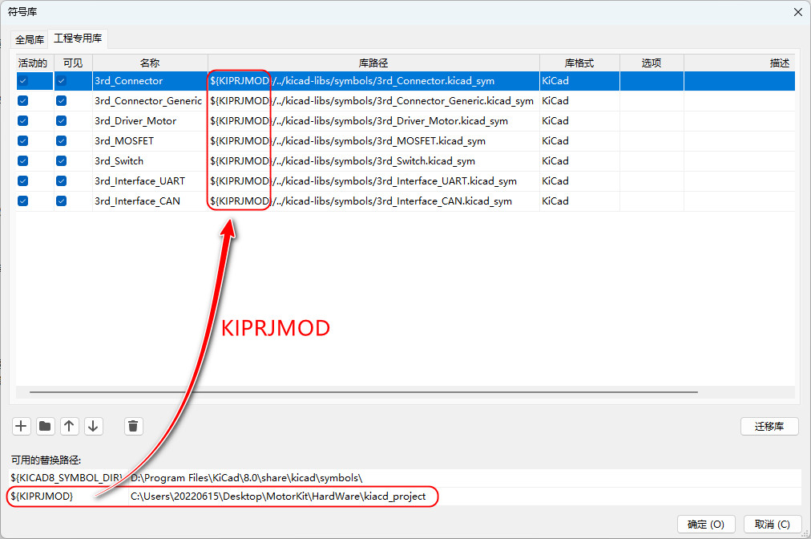

## KiCad 元器件库

该仓库用于收集 KiCad 默认库不支持且常用的元器件符号和封装，我除了使用 KiCad 自行设计之外还整理了一些开源平台/社区网友提供的素材，将来自社区的符号/封装/3D模型 等设计进行了规范化的命名和分类，分类规则按照 JLC（嘉立创）以及 KiCad 官方的规则为准，并且都转化为了 KiCad v9.x.x 最新的文件格式，该仓库将会长期持续维护并新增元器件和分类（适用于 KiCad Version 9.0.7 Release Candidate 1 Available Mon, Dec 15, 2025）。

所有文件，目录都以 `3rd_` 作为前缀，表示文件来自第三方，这样便于区别我们自己导入的符号/封装和 KiCad 官方的符号/封装，后续看到以 `3rd_` 开头的文件即可以知道这是我们添加的库文件，同样使用封装时也便于在 KiCad 中搜索我们添加的非官方库文件。

(1) 3dmodels/: 元器件 3D 模型库。

(2) footprints/: 元器件封装。

(3) symbols/: 元器件符号库。

(4) docs/: 嘉立创封装命名标准文档，这里均按照该文档的命名和分类方式。

(5) kicad/: 用于符号库和封装库测试的 KiCad v9.0.6 工程。

## 封装命名规则

### 1.命名

使用下划线 `_` 分割不同的描述（或叫规格）类别，使用横杆 `-` 分割相同描述同一类别的不同属性。

**例如**：在 KEY-SMD_L4.2-W3.2-V_SKRPABE010 和 QFN-88_L10.0-W10.0-P0.40 两个封装命名中：

其中器件尺寸描述 `L4.2-W3.2` 和 `L10.0-W10.0`，L 和 W 同属于尺寸描述类别，只是属性不同所以 L, W 两者使用 `-` 分割（长宽不包含引脚的长度，属于纯粹芯片封装外壳的尺寸，单位默认是毫米 mm）。

而 `KEY-SMD` 和 `L4.2-W3.2` 描述的是不同类别，两者使用 `_` 分割。

在 `docs` 文件夹下放置有封装命名参考文档，该文档来自嘉立创 EDA，及其他的一些行业规范/规则，除此之外也可以参考 [PCB封装命名规范](https://www.cnblogs.com/chengerccj/p/15004728.html) 这篇博客。

### 2. 分类

符号涉及元器件管脚的功能，所以符号库需要按照元器件的类别及功能（例如 DCDC，MCU，Flash，Memery，Connector，...）和产商名称（例如 ST，TI，NXP，Infineon，...）进行分类。

**例如**：在 3rd_MCU_AllWinner_F1C 符号库命名中：

其中 MCU 描述符号库功能为控制器芯片，AllWinner 描述符号库对应元器件的厂商为 “全志”。

封装分为通用封装（例如 QFN，QFP，SOT，SO 等）和专用封装（例如 USB，HDMI 封装）对于专用封装，封装库需要按照元器件的功能（例如属于 DCDC，MCU，Connector）进行分类，但无需区分产商。

3D 模型和封装是深度绑定的（特别在管脚数和外形尺寸上），所以 3D 模型库分类，命名规则和封装库的分类方法是相同的。

## 注意事项

由于从事器件制造的产生商很多，所以在物理上同一种封装可能存在多种命名，这实际上对我们制作封装，管理封装带来了一些困难，在设计器件的封装时一定要认真查阅器件的不同厂商的数据手册，看看是否是同一种封装。

- SOP (Small Outline Package) 小外形封装。在 EIAJ 标准中，针脚间距为 1.27mm (50mil) 的此类封装被称为 SOP。请注意，JEDEC 标准中所称的 SOP 具有不同的宽度。
- DSO (Dual Small Out-lint) 双侧引脚小外形封装（SOP 的别称）。
- SO (Small Outline) SOP 的别称。
- HSO (Heterogeneous Small Outline Package) 非对称 SOP 封装，适用于需要区分芯片正反面的场合。 
- HSOP (High-speed Small Outline Package) 高速 SOP 封装，适用于高速处理器和存储器控制器等芯片。 
- SOL (Small Out-Line L-leaded package) 按照 JEDEC 标准对 SOP 所采用的名称
- SOIC (Small Outline Integrated Circuit) 小外形集成电路。有时也称为 SO 或 SOL，在 JEDEC 标准中，针脚间距为 1.27mm (50mil) 的此类封装被称为 SOIC。请注意， EIAJ 标准中所称的 SOIC 封装具有不同的宽度 。
- SOW (Small Outline Package(Wide-Type)) 宽体 SOP，部分半导体厂家采用的名称。
- SSOP (Shrink Small Outline Package) 缩小外形封装。
- VSOP (Very Small Outline Package) 甚小外形封装。
- VSSOP (Very Shrink Small Outline Package) 甚缩小外形封装。
- TSOP (Small Outline Package) 薄小外形封装，适用于内存和存储器控制器等芯片。
- TSSOP (Thin Shrink Small Outline Package) 薄的缩小外形封装。
- MSOP (Mini Small Outline Package) 迷你小外形封装。 Analog Devices 公司将其称为 microSOIC，Maxim 公司称其为 SO/uMAX，而国家半导体 National Semiconductor 公司则 称之为 MiniSO。
- SOJ (Small Out-Line J-Leaded Package) J 形引脚小外型封装。
- SOT (Small Outline Transistor) 小外形晶体管。
- SON (Small Outline No-leads Package) 小外形无引脚封装，可用于减少占用空间。 

SO/SOP/SOIC 混乱现象主要出现在管脚间距 1.27mm 的封装上（混乱的多为 74 系列的数字逻辑芯片）。这类封装的两个标准对代码缩写和封装尺寸定义各有自己的习惯，EIAJ 习惯上使用 SOP 5.3mm 体宽，JEDEC 习惯上使用 SOIC 3.9mm 与 7.5mm 两种体宽，也有些公司并不遵守这个习惯，如 UTC ，使用 SOP3.9mm 与 7.5mm 两种体宽。

**总结**

在组织封装库的时候特别要注意 SO/SOP/SOIC 这类封装的分类，所以其实可以将这类封装按照 "标准" 和 "非标准" 进行分类，在同一类中各个封装的区别只有管脚数量上的差异。

对于 SO/SOP/SOIC 这类封装 kicad-libs 的做法是目前只整理标准的 SO/SOP/SOIC。

## 使用方法

(1) 拉取 kicad-libs 文件夹，将 kicad-libs 文件夹及内部文件下载到到电脑的本地目录。具体可以放到工程目录下，也可以放到一个公共目录，然后每个 PCB 工程在这个公共目录引用 kicad-libs 库文件。

(2) 启动 KiCad，在 KiCad 的主页中的设置菜单选下下，点击 "管理符号库" 选项，在弹出的符号库管理面板中可以选择 "全局库"，也可以选择 "工程专用库"，将 kicad-libs/symbols 文件夹下用到的符号库相应的目录添加到 "符号库" 中。

(3) 同理在 KiCad 的主页中的设置菜单选下下，点击 "管理封装库" 选项，在弹出的封装库管理面板中可以选择 "全局库"，也可以选择 "工程专用库"，将 kicad-libs/footprints 文件夹下用到的封装库相应的目录添加到 "封装库" 中。

(4) 在添加符号库和封装库的过程中可以将 KIPRJMOD 定义为 KiCad 工程所在的目录，在引用库的时候可以用 KIPRJMOD 来定位 kicad-libs 所在的路径。

(5) 封装命名以及分类方式不是和符号一一对应的，因为封装面向的是实际元器件，各种各样的元器件都可以使用同一种封装（特别是芯片），比如一个音频芯片和一个 SpiFlah 都有可能使用 SO-8 的封装，认准封装就对了！

(6) 对于不熟悉的元器件，给元件符号分配封装前先阅读器件的数据手册，在数据手册上找到它的封装以及尺寸，然后在封装库中找到对应的封装分配给符号。

(7) 默认情况下封装是没有与封装对应的元件 3D 模型配对绑定的，所以需要自己在 PCB 设计完成后，在 PCB 编辑器的视图下选择 PCB 上的每一个封装，然后在封装属性上为封装指定对应的元件 3D 模型（当然你也可以直接编辑封装将 3D 模型绑定到封装中，但是这里不建议这么做，因为这样一对一绑定后使用并不灵活，同时一个 3D 模型是可以适用于类似器件的，并非一对一的关系）。

## 适用版本

官方链接：[https://www.kicad.org/]([https://www.kicad.org/](https://www.kicad.org/))

KiCad Version 9.0.7 Release Candidate 1 Available Mon, Dec 15, 2025

## 简单介绍

KiCad 是一个免费开源的电子设计自动化 (EDA) 套件，相比 Altium Designer，Cadance 这些软件 KiCad 包含一个高质量的组件库，其中包含数千个符号、足迹和 3D 模型（自带了很多流行的器件符号和封装，用起来非常方便）。

相比 Altium Designer，Cadance 也更容易上手，设计格式也被主流的 PCB 制造商支持（比如嘉立创，华秋都主动支持 KiCad）。

它具有示意图捕获、集成电路仿真、印刷电路板 (PCB) 布局、3D 渲染以及多种格式的绘图/数据导出等功能。

对系统要求很低，并且可以在 Linux、Windows 和 MacOS 上运行。
